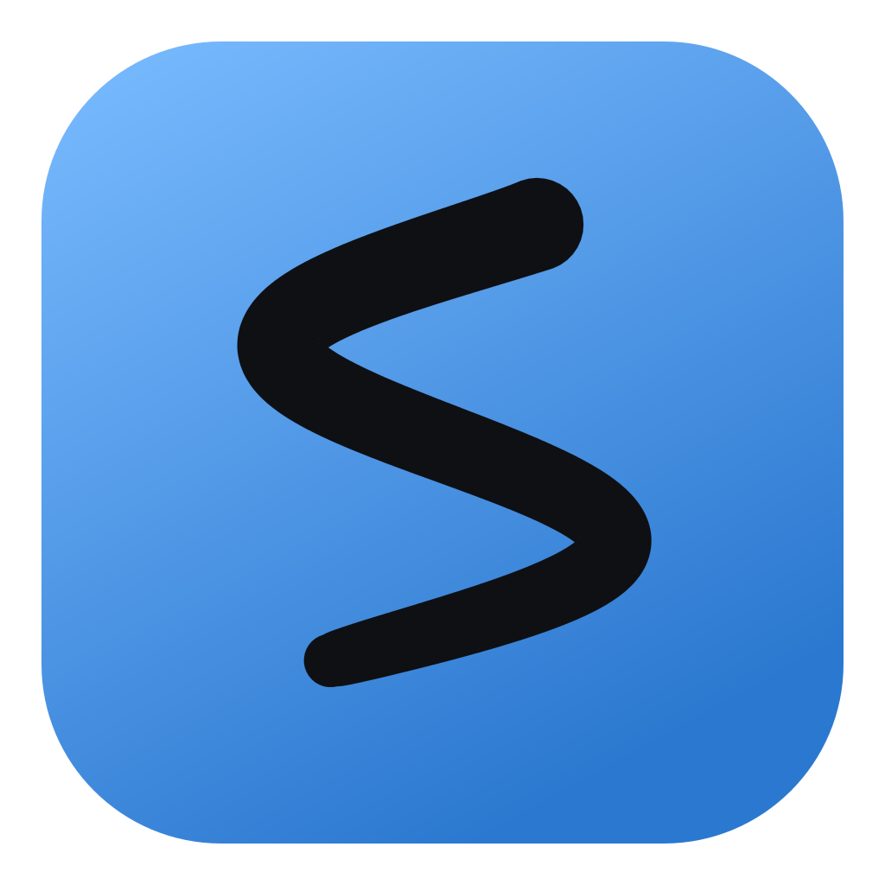

# Sussurro IA



**Dettatura vocale per Windows.** Tieni premuta una scorciatoia, parla, e il testo
compare nel campo in cui stavi già scrivendo — senza toccare il mouse, senza
cambiare finestra, senza copiare e incollare da nessuna parte.

La mail che stavi scrivendo, la casella di ricerca, il terminale, il commento in
un'altra applicazione: il testo va dove stava il cursore.

> ⚠️ **Versione beta.** Funziona, ma può contenere difetti e può cambiare senza
> preavviso. Non affidarti a Sussurro IA per lavoro critico o per testo che non
> puoi permetterti di perdere. Leggi le [condizioni d'uso](CONDIZIONI.md) prima
> di installare.

---

<!--
  DA FARE PRIMA DI DIVULGARE IL REPO: registrare una clip di 30 secondi.
  Apri il Blocco note, tieni premuto Ctrl+Win, di' una frase, rilascia, e mostra
  il testo che compare. Poi ripeti con Ctrl+Shift+Win per far vedere la
  traduzione. Salvala come GIF o MP4 e trascinala nell'editor di questo README:
  GitHub la carica e la incorpora da solo.

  È la cosa che convince: questa app è impossibile da descrivere e istantanea
  da mostrare.
-->

## Come si detta

| Scorciatoia | Cosa esce |
|---|---|
| `Ctrl` + `Win` | il testo così come l'hai detto, ripulito dagli intercalari e punteggiato |
| `Ctrl` + `Shift` + `Win` | il testo **tradotto** in inglese, spagnolo o tedesco |
| `Ctrl` + `Shift` + `Win` | oppure **riscritto come prompt**, se scegli quel modo |

Tieni premuto mentre parli, rilascia quando hai finito. Non c'è un tasto per
iniziare e uno per finire.

**Si detta in italiano.** È la lingua che l'app dichiara al servizio di
trascrizione, ed è quella su cui è tarata.

**Il modo prompt** merita una riga a sé: non traduce, resta in italiano. Prende
quello che hai raccontato a voce — «vorrei un'app che mi gestisce le fatture con
lo scadenzario» — e lo riscrive come richiesta ben posta, con i requisiti per
punti e l'elenco delle cose che non hai detto e che chi legge andrebbe altrimenti
a indovinare.

### Perfeziona il testo

C'è un interruttore — nel cruscotto, o con un clic sulla pillola — che cambia il
risultato di **entrambe** le scorciatoie: la dettatura non viene solo trascritta,
viene **riscritta in italiano scritto**. Si sciolgono i giri di parole, si ordina
la sintassi, spariscono intercalari e falsi inizi, e i concetti separati finiscono
in paragrafi distinti.

Quello che **non** fa, ed è la parte che conta:

- non aggiunge fatti, nomi, numeri o date che non hai detto;
- non riassume e non taglia: nessun contenuto sparisce;
- non attenua e non rafforza. «Questo contratto è una truffa» non diventa
  «ritengo che questo contratto sia una truffa»: aggiungere una prudenza che non
  avevi è un cambio di contenuto travestito da cambio di registro. Chi detta
  arrabbiato ha diritto a un testo arrabbiato, scritto bene.

### Comandi detti

Chi detta non può premere Invio né aprire il pannello delle emoji, quindi alcune
parole diventano quello che rappresentano, nel punto in cui le dici:

| Dici | Ottieni |
|---|---|
| «a capo», «vai a capo», «torna a capo», «nuova riga» | un a capo |
| «nuovo paragrafo», «doppio a capo» | una riga vuota di stacco |
| «emoji sorriso», «emoji pollice su», «emoji cuore», … | 🙂 👍 ❤️ |

Il prefisso «emoji» (o «faccina») è obbligatorio: «sorriso» e «cuore» da soli
sono parole correntissime, e riconoscerle significherebbe cancellarle dal testo
di chi le stava semplicemente dicendo.

## Installazione

Requisiti: **Windows 10 o 11 a 64 bit** e un microfono.

Scarica dalla pagina **[Releases](../../releases/latest)**:

| File | Quando usarlo |
|---|---|
| `Sussurro.IA_1.0.1_x64-setup.exe` | installazione normale — **consigliato** |
| `Sussurro.IA_1.0.1_x64_it-IT.msi` | installazioni gestite, distribuzione aziendale |
| `sussurro.exe` | l'eseguibile da solo, se preferisci non installare niente |

Gli SHA256 sono pubblicati nel corpo di ogni release e in
[CHECKSUM.txt](CHECKSUM.txt): se vuoi verificare che il file scaricato sia quello
giusto, in PowerShell basta `Get-FileHash <file> -Algorithm SHA256`.

### Sblocca il file prima di eseguirlo

Sussurro IA **non è firmata** con un certificato di code signing: costa un token
hardware e un canone annuale, fuori portata per un programma gratuito. Senza
firma, Windows mostra **«Windows ha protetto il PC»** quando esegui un file
appena scaricato.

Il modo pulito di evitarlo richiede dieci secondi e va fatto **una volta sola**,
subito dopo il download:

1. Tasto destro sul file scaricato → **Proprietà**
2. In fondo alla scheda *Generale*, spunta **«Annulla blocco»**
3. **OK**, e poi esegui normalmente

Da PowerShell, se preferisci:

```powershell
Unblock-File "$HOME\Downloads\Sussurro.IA_1.0.1_x64-setup.exe"
```

Perché funziona: il browser marchia i file scaricati, e Windows mostra l'avviso
solo per i file che portano quel marchio. Toglierlo prima di eseguire è un gesto
consapevole — meglio che abituarsi a cliccare «Esegui comunque» su un avviso di
sicurezza, che è un riflesso da non allenare.

Se hai già eseguito il file e ti trovi davanti al pannello, la via d'uscita è
**Ulteriori informazioni → Esegui comunque**.

### Con winget — in arrivo

Il pacchetto è in attesa di approvazione nel catalogo ufficiale di winget
([pull request #418481](https://github.com/microsoft/winget-pkgs/pull/418481),
validazione automatica superata). Appena viene accettata l'installazione diventa:

```
winget install RobertoB.SussurroIA
```

Per questa via **non compare nessun avviso di SmartScreen** e non serve sbloccare
niente: winget scarica il file da sé, ne verifica lo SHA256 e non gli applica il
marchio da cui dipende l'avviso.

Finché la pull request non è unita, quel comando risponde
`No package found matching input criteria`: usa il download qui sopra.

### L'antivirus potrebbe dire qualcosa

Sussurro IA aggancia la tastiera di sistema per riconoscere la scorciatoia, ed è
lo stesso meccanismo che usano i keylogger: un antivirus con analisi
comportamentale può segnalarlo. Che cosa il programma faccia davvero di quei
tasti — e perché il codice dei tasti normali non entra nemmeno nel programma — è
spiegato in [Che cosa esce da questo computer](#che-cosa-esce-da-questo-computer).

## Serve una chiave API Groq

Sussurro IA non trascrive sul tuo computer: manda l'audio a **Groq**, che è di
gran lunga il più rapido sulle clip brevi — circa 350 ms per una frase. La chiave
è tua, l'account è tuo, e il piano gratuito **non chiede la carta di credito**.

Due minuti in tutto:

1. **Registrati** su [console.groq.com](https://console.groq.com) — con Google,
   GitHub o una email. Niente dati di fatturazione, niente attese di approvazione.
2. **Apri** [console.groq.com/keys](https://console.groq.com/keys).
3. **Premi «Create API Key»** e dalle un nome qualsiasi, per esempio `sussurro-ia`.
4. **Copiala subito.** Compare una volta sola e comincia per `gsk_`. Se la perdi
   non è un dramma: si cancella e se ne crea un'altra, ma non c'è modo di
   rileggerla.
5. **Incollala nell'app**: clic sull'icona di Sussurro IA nell'area di notifica
   (vicino all'orologio) → **Cruscotto** → pannello **chiave API** → incolla e
   premi **salva**. La pastiglia diventa verde.

La chiave finisce nel **Gestore credenziali di Windows**, mai in un file, mai nei
log, e viene riletta dal portachiavi a ogni richiesta.

Il piano gratuito di Groq ha limiti di frequenza abbondanti per l'uso personale —
una dettatura è una richiesta di pochi secondi di audio. I limiti aggiornati sono
su [console.groq.com/settings/limits](https://console.groq.com/settings/limits).
Il costo delle trascrizioni, se un giorno superassi il piano gratuito, è a tuo
carico secondo le tariffe di Groq.

## Primo avvio

L'app parte in secondo piano: non ha una finestra principale. Quello che vedi è
una **pillola** sempre in primo piano, un ovale piccolo su un bordo dello schermo,
che mostra lo stato — a riposo, in ascolto, in elaborazione — e la sigla della
lingua di uscita.

La pillola **non mostra mai il testo**: quello va a destinazione, non sullo schermo.

Prima prova consigliata: apri il Blocco note, tieni premuto `Ctrl`+`Win`, di'
qualcosa, rilascia.

Dal **cruscotto** si configura tutto e si legge lo stato reale dell'applicazione.
È diviso in due schede, e quella che stavi usando viene ricordata:

- **uso** — chiave API, modo di uscita, perfezionamento, posizione della pillola,
  avvio automatico, e il promemoria di come si detta;
- **diagnostica** — la catena del segnale, cioè dove si è fermata una dettatura, i
  contatori e il registro delle ultime dettature.

### Scegliere i modelli

C'è un pannello che permette di cambiare il modello usato da ciascuno dei due
slot — quello che trascrive la voce e quello che traduce o riscrive. Puoi chiedere
all'endpoint l'elenco dei modelli adatti a quel mestiere, oppure scrivere un nome
a mano se il filtro è troppo severo.

Prima di adottarne uno puoi **provarlo**: l'app gli manda le frasi che smascherano
i modelli che *rispondono* invece di tradurre — «qual è la capitale della
Francia?» deve tornare tradotta, non deve tornare «Parigi» — e lo fa **in tutte le
lingue di uscita**, non solo in quella attiva. Il motivo è concreto: le difese
contro quel comportamento non reggono allo stesso modo in ogni lingua, e provarne
una sola significa scoprire il problema il giorno in cui cambi lingua, a metà di
una dettatura, con il testo già finito nel documento.

## Che cosa esce da questo computer

La stessa informativa compare al primo avvio dell'app e si rilegge quando vuoi dal
pulsante **«che cosa esce da questo computer»**.

**L'audio** esce solo mentre tieni premuta la combinazione, e va al servizio che
hai configurato tu con la tua chiave. Fuori da quei secondi il microfono non
registra.

**La tastiera.** Per riconoscere una combinazione di soli modificatori Windows non
offre alternative a un hook di sistema, che per costruzione riceve ogni tasto
premuto sul computer. Sussurro IA **scarta il codice dei tasti che non sono
modificatori nel punto esatto in cui lo riceve**, prima di qualunque altra
operazione: non entra nel programma, non viene salvato, non viene trasmesso. Di
ciò che digiti resta soltanto il fatto che un tasto è stato premuto, che serve ad
annullare la dettatura quando stai usando un'altra scorciatoia.

**Gli appunti** vengono letti per conservarne il contenuto, usati per incollare il
testo, e **ripristinati subito dopo**.

**Il testo dettato** non viene mai scritto su disco e non compare nei log. Il
registro del cruscotto vive finché la finestra è aperta.

**Sul computer restano** due preferenze in un file di testo e la chiave API nel
Gestore credenziali.

**Verso chi ha realizzato il programma non arriva niente.** Nessuna telemetria,
nessuna statistica d'uso, nessun controllo aggiornamenti: l'unica connessione di
rete che l'app apre è quella verso l'endpoint di trascrizione che hai configurato.

## Se qualcosa non va

| Sintomo | Dove guardare |
|---|---|
| le scorciatoie non rispondono più | cruscotto → azioni → **forza reinstallazione hook** |
| registra ma non esce testo | pannello **chiave API**: la pastiglia è verde? |
| il testo finisce nella finestra sbagliata | verifica che **pillola non attivabile** sia spuntato |
| esce testo su frasi mai dette | è un'allucinazione sul silenzio: parla più vicino al microfono |
| il menu Start si apre a ogni dettatura | spunta **blocca il menu Start al rilascio di Win** |
| non capisci dove si è fermata | la **catena del segnale**: il contatore che smette di crescere dice quale giunzione è muta |

Se non basta, **[apri una segnalazione](../../issues/new/choose)**. Nel modulo
trovi già le domande che servono a capire il problema senza scambi di messaggi.

> Non incollare mai nelle segnalazioni la tua **chiave API** né il **testo che hai
> dettato**: le issue sono pubbliche.

Per domande, idee e richieste di funzionalità c'è la sezione
**[Discussions](../../discussions)**.

## Licenza

Software proprietario, gratuito da usare. **Tutti i diritti riservati.**
Le condizioni complete sono in [CONDIZIONI.md](CONDIZIONI.md) e vengono mostrate
durante l'installazione.

Il codice sorgente non è pubblico. Questo repository serve alla distribuzione,
alle segnalazioni e alla documentazione.
